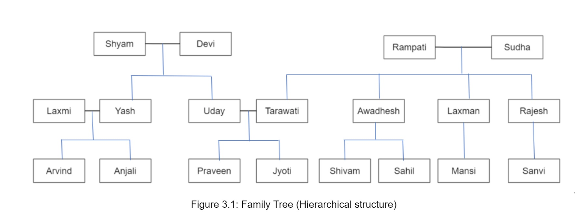

# prolog
This Repository Contains programs written in *Prolog* programming language


|  | Details |
| ----------- | ----------- |
| Author | Jyoti Maurya |
| Course | M.Tech Computer Science and Engineering (Artificial Intelligence) |
| Subject | MCS-109 AI based Programming Tools |
| University | Indira Gandhi Delhi Technical University for Women |
| Language | Prolog |
| Compiler | GNU Prolog (http://www.gprolog.org/) |
| Operating System | Windows 10 |


Following Prolog Programs are part of this Repo
1. The Tower of Hanoi Solver
2. The Monkey Banana Problem Solver
3. Family Tree Prolog Program

## The Tower of Hanoi Solver
**Problem**: Towers of Hanoi Problem is a problem to move N disks from the source tower to the target tower using an auxiliary holding tower.

**PROCEDURE:**
There are two conditions that are to be followed while solving this problem :
1. A larger disk cannot be placed on a smaller disk.
2. Only one disk can be moved at a time.

Steps:
1. Create the Knowledge Base (Hanoi_Tower.pl) by creating an empty file with .pl extension.
2. Create predicates that move the disk from tower 1 to tower 2. Both tower 1 and tower 2 can be any of the source, auxiliary, and target.
    -  Define it for base case i.e. when number of disks are 1
    move(1,X,Y,_) :-
   			write('Move top disk from '), write(X), write(' to '), write(Y), nl.
    - Define another move rule such that it takes care of any number of disks.
move(N,X,Y,Z) :-
  			 N>1,
  			 M is N-1,
  			 move(M,X,Z,Y),
  			 move(1,X,Y,_),
 			 move(M,Z,Y,X).
3. Verify if your program is giving the desired result by running Queries.

Query 1: move(1, source, target, auxiliary).
Query 2: move(2, a, c, b)
Query 3: move(3, pole1, pole3, pole2).
Query 4: move(4, source, target, auxiliary)

RESULT: The Tower of Hanoi Prolog Program is able to produce the correct results for the queries.
## The Monkey Banana Problem Solver

Problem: A hungry Monkey is in a room, and it is near the door. The monkey is on the floor. Bananas have been hung from the ceiling of the room. There is a block(or chair) present in the room near the window. The Monkey wants to Reach the Banana, but cannot reach it. How can the monkey get the Banana?

PROCEDURE: 
We have some predicates that will move from one state to another state, by performing action.
Actions:
- grasp
When the block is in the middle, and the monkey is on top of the block, and the monkey does not have the banana (i.e. has not state), then using the grasp action, it will change from has not state to have state.
- climb
From the floor, it can move to the top of the block (i.e. on top state), by performing the action climb.
- drag
The push or drag operation moves the block from one place to another.
- walk
Monkey can move from one place to another using walk or move clauses.

Predicates: 
- move
- canget

When we have reached the state ‘has’ then we will stop the execution.

Query: 
NOTE: To start the debugger mode, we use trace.
Query: 
```
?- trace.
?- canget(state(atdoor, onfloor, atwindow, hasnot)).
```
RESULT: The program is able to solve the monkey banana problem successfully.
By using the debugger mode, we can get all the steps that was taken to reach the end i.e. monkey ‘has’ banana state.


## Family Tree Prolog Program

**Problem**: Write Prolog Program of your Own Family Tree

**PROCEDURE:**
1. Draw a hierarchical diagram of your family tree so that you can clearly identify or see the relationships between different people through the diagram ( as shown in Figure 3.1)
2. Create the Knowledge Base (jyoti_maurya_family_tree.pl) in Prolog
3. Identify the Rules that you want to create
4. Write the Program such that you
    - Define all the Predicates ( Example: male(shyam), female(Devi), etc.)
    - Define all the Rules (Example: is_grandfather_of(grandfather, grandchild), are_siblings(X,Y), etc.)
5. Verify if your program is giving the desired result by running Queries.




In the above diagram:
- Blue Lines denote the parent-child relationship
- Black line denotes the husband-wife relationship

To represent relationships among objects, Prolog is the most widely used language.

Points to remember :
- All person’s name is written in lowercase letters inside the program 
- Variables used in Query start with Uppercase letters. Eg: X.

Rules:
You can use the following Rules:
- husband
- wife
- are_married
- parent
- is_mother_of
- is_father_of
- is_grandparent_of
- is_grandmother_of
- is_grandfather_of
- are_siblings
- are_cousins
- are_sisters
- are_brothers
- has_sister
- has_brother

QUERIES:

Find out whose husband Uday is?
Query: ```husband(uday,X).```

Find out all the wifes and their husband
	Query: ```wife(X,Y).```

Find out if uday and tarawati are married couple
	Query: ```are_married(uday, tarawati).```

Find out parent of jyoti
	Query: ```parent(/x, jyoti).```

Find out who is the mother of awadhesh
Query: ```is_mother_of(X, awadhesh).```

Find out who is the father of arvind
Query: ```is_father_of(X, arvind).```

Find out the grandparents of praveen
Query: ```is_grandparent_of(X, praveen).```

Find out all the grandmothers in the family tree
Query: ```is_grandmother_of(X, Y).```

Find out the grandfather of sanvi
Query: ```is_grandfather_of(X, sanvi).```

Find out all the siblings of jyoti
Query: ```are_siblings(X,jyoti).```

Find out the cousins of jyoti
Query: ```are_cousins(jyoti, sanvi).```

Find out if there are any sisters in the family tree (sisters are those that contain same parents only)
Query: ```are_sisters(X, Y).```

Find out if there are any brothers of uday in the family tree (brothers are those that contain same parents only)
Query: ```are_brothers(uday,Y).```

Find out if praveen has any sister
Query: ```has_sister(praveen,X).```

Find out if jyoti has brother(s) (brothers are those that contain same parents only)
Query: ```has_brother(jyoti, X).```

**RESULTS:** The Family Tree Prolog Program is able to give correct results for the queries.

---
Feel free to contact me for any queries.
LinkedIn: https://www.linkedin.com/in/jyotimaurya09 
---